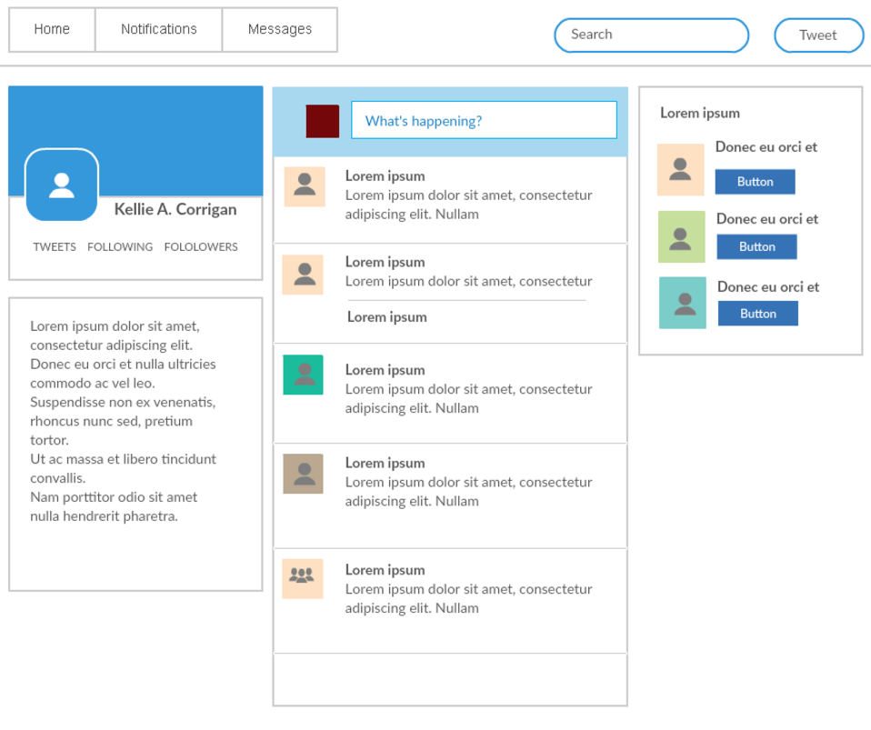
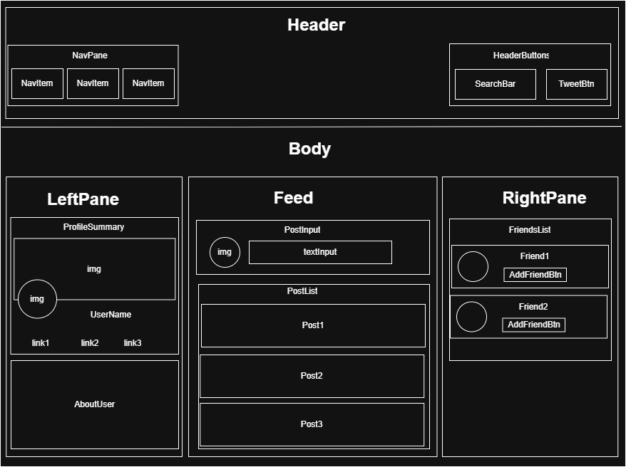

# Social Media React App
React was originally developed by Facebook to manage the dynamic, complex needs of a large social media app. After observing Facebook's success, many other social media applications have also begun relying on React.

This project was to assist get my hands dirty with React components as the mock-up below came to life.

### Mockup

### Component Diagram

